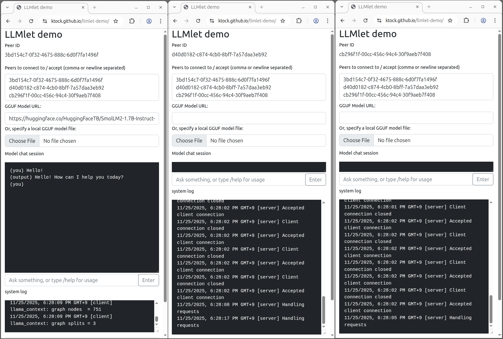

# LLMlet: P2P distributed LLM inference on browsers

LLMlet enables distributed LLM inference on browsers using [Wasm-compiled llama.cpp](https://github.com/ggml-org/llama.cpp/blob/10e9780154365b191fb43ca4830659ef12def80f/docs/build.md#webgpu-in-progress) connected via WebRTC using [PeerJS](https://peerjs.com/).
It allows models that can't fit in a single browser tab to be split and executed across multiple browsers.

Demo page: https://ktock.github.io/llmlet-demo/

This is an experimental software.
See [Known limitations](#known-limitations).

## Quick start on GitHub Pages



Every browser tab acts as a peer.
On a peer, you can load a model, distribute the chunks to other peers and run inference on them.

This section describes an example of running 3 peers, using one of them as a client and two as servers.

### 1. Open the [demo page](https://ktock.github.io/llmlet-demo/) in 3 separated browsers or tabs

On each tab, a peer starts automatically using [PeerJS's public server](https://peerjs.com/peerserver) and displays its assigned ID.

In this example, the peers received the following IDs:

- `3bd154c7-0f32-4675-888c-6d0f7fa1496f`
- `d40d0182-c874-4cb0-8bff-7a57daa3eb92`
- `cb296f1f-00cc-456c-94c4-30f9aeb7f408`

On every peer, write the full list of IDs to the `Peers to connect to / accept (comma or newline separated)` field.
This makes each peer ready to handle requests from other peers.

### 2. Specify a model to use

You can use any peer as the client.
On the client peer, specify a model to use via an HTTP URL (e.g. GGUF file on Hugging Face) or by selecting a local file.
This example uses `https://huggingface.co/HuggingFaceTB/SmolLM2-1.7B-Instruct-GGUF/resolve/main/smollm2-1.7b-instruct-q4_k_m.gguf`.

### 3. Enter a prompt

Finally, enter a prompt in the `Ask something` textarea on the client peer to start inference.

> NOTE: It might take a while to distribute the model and run inference on each peer. `system log` window shows logs from llama.cpp and is convenient to see the progress. On each server peer, message such as `Handling requests` will appear during processing the client requests.

## Building

You can build LLMlet using make or Docker then serve them to browsers using HTTP servers.

### Using make

- Prerequisites
  - [emsdk](https://emscripten.org/docs/tools_reference/emsdk.html) >= 4.0.16
  - [dawn](https://dawn.googlesource.com/dawn) (emdawnwebgpu): `f027ea4350860470ff04ecfda07c5933754f69bb`

```
make EMDAWNWEBGPU_DIR=/path/to/emdawnwebgpu_pkg
```

This step creates the following files in the `build` directory.

- `llmlet-mod.js`
- `llmlet-mod.wasm`

### Using Docker

- Prerequisites
  - `docker build`

```
docker build --output type=local,dest=build .
```

This step creates the following files in the `build` directory.

- `llmlet-mod.js`
- `llmlet-mod.wasm`

### Running LLMlet locally

This section describes an example to run LLMlet using a localhost HTTP server.

Store the assets compiled in the previous steps to `/tmp/test/htdocs/`.

Then copy the following files from this repo to the same document root.

- `llmlet.js`: A JS file to configure and start a peer in the browser.
- `example/`: Contains an example index.html file for local testing.

```
cp llmlet.js example/* /tmp/test/htdocs/
```

`example/index.html` is intended for local testing and requires a localhost PeerJS signaling server.

```
docker run --rm -d --name peerjs -p 127.0.0.1:9000:9000 peerjs/peerjs-server
```

You can serve the assets using an HTTP server.

```
docker run --rm -d -p 127.0.0.1:8888:80 --name peer \
           -v /tmp/test/htdocs/:/usr/local/apache2/htdocs/:ro \
           httpd httpd-foreground \
           -c "Header set Cross-Origin-Opener-Policy: same-origin" \
           -c "Header set Cross-Origin-Embedder-Policy: require-corp"
```

> NOTE: This project relies on Emscripten's pthread support which requires additional headers as shown in the above command example. For more details, see https://emscripten.org/docs/porting/pthreads.html

Then the page is accesible via `localhost:8888`.

## How it works

LLMlet uses [PeerJS](https://peerjs.com/) to connect browsers with WebRTC and uses [llama.cpp's RPC feature](https://github.com/ggml-org/llama.cpp/blob/99c53d6558e1882fdddd1077495b618f3210cc02/tools/rpc/README.md) to run distributed LLM inferences.
Although llama.cpp already supports [Wasm compilation and WebGPU](https://github.com/ggml-org/llama.cpp/blob/10e9780154365b191fb43ca4830659ef12def80f/docs/build.md#webgpu-in-progress), patches were needed to function over WebRTC.

Peers use the [PeerJS's server](https://github.com/peers/peerjs-server) for setting up WebRTC connections among them.
Distributing model chunks and facilitating inference are done by the peer itself so additional servers aren't needed for those purposes.
The example is hosted on GitHub Pages and uses [PeerJS's public server](https://peerjs.com/peerserver).

## Known limitations

- Parallelism is not yet supported. Peers sequentially evaluates the model chunks and communication each other adds overhead to the inference speed. (related: https://github.com/ggml-org/llama.cpp/discussions/8500, https://github.com/ggml-org/llama.cpp/pull/16020 )
- Models are split in layer granularity so each peer must have enough resources to host at least one layer. (related: https://github.com/ggml-org/llama.cpp/pull/16020 )
- A server can't serve multiple clients simultaneously. When starting a second client in the network, the existing client must be stopped first.
- Demo page relies on PeerJS's public server which [doesn't offer](https://github.com/orgs/peers/discussions/1172) the [TURN](https://developer.mozilla.org/en-US/docs/Web/API/WebRTC_API/Protocols#turn) service for relaying packets among peers. So peers can't connect each other if they are in restricted network environments which don't allow P2P communication.

## Devices

LLMlet uses llama.cpp's [Wasm and WebGPU support](https://github.com/ggml-org/llama.cpp/blob/10e9780154365b191fb43ca4830659ef12def80f/docs/build.md#webgpu-in-progress) with the following configuration:

- The CPU backend is enabled when WebGPU is not supported in the browser. Available heap size is up to 2GB.
- The WebGPU backend is used when the browser supports WebGPU (see https://caniuse.com/webgpu). Note that WebGPU isn't enabled by default on some platforms (e.g. Chrome on Linux requires flags such as `enable-unsafe-webgpu`).
- The RPC backend is patched to recognize browser peers connected over WebRTC via PeerJS.

## Motivation

Browsers offer portable execution environments such as Wasm and WebGPU, making it possible to run LLMs inside browser.
However, a single browser can't run models that exceed its memory capacity.
This project addresses this limitation by directly linking multiple browsers and using them as a single larger computing environment.

## Troubleshooting

- **WebGPU backend is not enabled**
  - Ensure that the browser supports WebGPU and that any required browser flags are enabled (c.f. https://caniuse.com/webgpu).
- **Inference fails with an allocation failure**
  - The maximum heap size of the Wasm module is configured as 2GB. To increase total available memory, open another browser tab and join it to the network as an additional peer.
- **Inference failes with `Remote RPC server crashed or returned malformed response`**
  -  If it is a temporary connection failure, you can restart inference using `/restart` command on the client peer. If it fails frequently, connecting to peers from a different network (e.g. different WiFi network) might improve the connection.
- **LLM prints corrupted string**
    - Try reloading and restarting the page. Stale data might be cached in the IndexedDB named `ChunkCache` so remove them ([a guide to delete IndexedDB data on chrome](https://developer.chrome.com/docs/devtools/storage/indexeddb?hl=en#deletedatabase)).

## Similar projects

- Frameworks such as [llama.cpp](https://github.com/ggml-org/llama.cpp) and [vLLM](https://github.com/vllm-project/vllm) support distributed inference over multiple machines but they don't work across browsers.
- [web-llm](https://github.com/mlc-ai/web-llm) and [wllama](https://github.com/ngxson/wllama) enable LLM inference inside browser but they don't support distributed inference.
- [exo](https://github.com/exo-explore/exo) enables to connect multiple devices to create an AI cluster. However it doesn't support browsers.
- [DistML.js](https://github.com/mil-tokyo/distmljs)([paper](https://arxiv.org/abs/2407.01023)) supports distributed training on browsers with data parallelism. However it isn't designed as peer-to-peer communication among browsers and uses a server to distribute weights and facilitate inference.

## Acknowledgement

This project relies on third party softwares including the following.

- [llama.cpp](https://github.com/ggml-org/llama.cpp) ([MIT License](https://github.com/ggml-org/llama.cpp/blob/0de8878c961c36c88cca5a0c188ae7a6e5a4b778/LICENSE))
- [Dawn](https://dawn.googlesource.com/dawn) ([BSD 3-Clause License](https://dawn.googlesource.com/dawn#license))
- [PeerJS](https://github.com/peers/peerjs) ([MIT License](https://github.com/peers/peerjs/blob/125f450c547887982ddecc86a6719f22e0f8f952/LICENSE))
