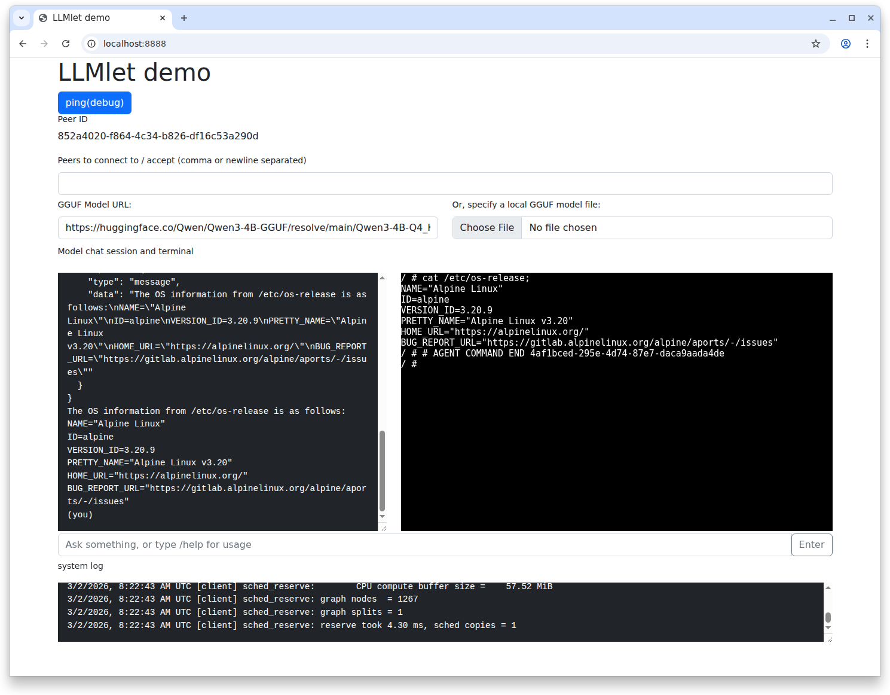

# Example: Allow the model to run commands in a container inside browser

See [`../examples/function-calling/`] for the basics of the function calling in LLMlet.

This demo enables the model to access to a Linux container environment running completely inside browser using [container2wasm](https://github.com/ktock/container2wasm).
container2wasm is a container-to-wasm image converter which enables to run Linux-based container fully inside browser, leveraging CPU emulators like QEMU.

See the [container2wasm](https://github.com/ktock/container2wasm) repo for details about that project.

## Demo 

### 1. Open the example page using a local HTTP server

First, prepare the document root following the "Building" section in [`../../README.md`](../../README.md).

Then, copy the assets in this directory (`examples/container/`) to the document root and start the server.

```
cp ./examples/container/{index.html,functions.js} /tmp/test/htdocs/
```

### 2. Convert a container to Wasm to run inside browser

Get [container2wasm](https://github.com/ktock/container2wasm) on your machine.

Then, the following command converts an alpine container to a Wasm blob so that it can run inside browser.
Refer to the container2wasm repo for details (e.g. about how the conversion works).

```
c2w --to-js alpine /tmp/test/htdocs/
```

### 3. Open the browser and specify a model

Push the "start terminal" button to start the terminal.
Specify a model that support function calling.

> NOTE: If the model is too small, it can't handle functions well so you might need enoughly large models such as [`Qwen3 4b`](https://huggingface.co/Qwen/Qwen3-4B-GGUF/blob/main/Qwen3-4B-Q4_K_M.gguf) (`https://huggingface.co/Qwen/Qwen3-4B-GGUF/resolve/main/Qwen3-4B-Q4_K_M.gguf`).

### 4. Enter a prompt

We give the model an access to the container's shell via the function calling feature.
Note that the container and the Linux kernel run fully inside browser so the model doesn't get the direct access to the host system outside of the browser.

To achieve this, the following function is provided to the model.

- `system`: Runs an arbitrary shell command in the container and returns the output.

A prompt like `Get the OS information from the /etc/os-release file` lets the model complete the task in the shell inside browser.


