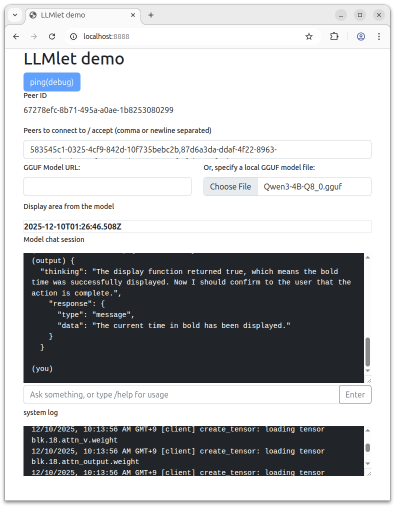

# Example: Allowing function calling from the model

You can define functions and provide them to the model via the system prompt.
LLMlet also allows to hook the model output, detect function calling and invoke the corresponding function.

## Demo

### 1. Open the example page using a local HTTP server

First, prepare the document root following the "Building" section in [`../../README.md`](../../README.md).

Then, copy the assets in this directory (`examples/function-calling/`) to the document root and start the server.

```
cp ./examples/function-calling/{index.html,functions.js} /tmp/test/htdocs/
```

### 2. Specify a model

Specify a model that support function calling.

> NOTE: Small models don't seem to be able to handle functions well so you might need enoughly large models such as `Qwen3 4B`.

### 3. Enter a prompt



This example provides the following functions to the model.

- `get_date_tool`: Returns the current time in the ISO 8601 format.
- `display_tool`: Receives a string and displays it. HTML syntax is allowed.

So, a prompt like `Display the current time in bold fonts.` lets the model call those functions to get the date and display it in the `Display area from the model` section on the page.

## How it works

This directory contains an example JS file [`./functions.js`](./functions.js) which contains funciton definitions and a system prompt to enable the model to call functions.
An example function is defined as the following, [in a similar schema as used by OpenAI](https://platform.openai.com/docs/guides/function-calling#defining-functions).

```
var display_tool = {
    func: (arg) => {
        document.getElementById("display-from-model").innerHTML = arg.target_string;
        return true;
    },
    description: {
        type: "function",
        name: "display",
        description: "Receives a string and displays it. HTML syntax is allowed. When it succeeded, this function returns true",
        parameters: {
            type: "object",
            properties: {
                "target_string": {
                    "type": "string",
                    "description": "String to display. HTML syntax is allowed."
                },
            },
            required: ["target_string"],
            additionalProperties: false
        },
        strict: true
    },
};
```

They are passed to the model via the system prompt as defined in the `createToolsSystemPrompt` function in [`./functions.js`](./functions.js).
Each output from the model is hooked by `callTools` function and is checked if it describes a function calling.
If so, the corresponding function is invoked.
